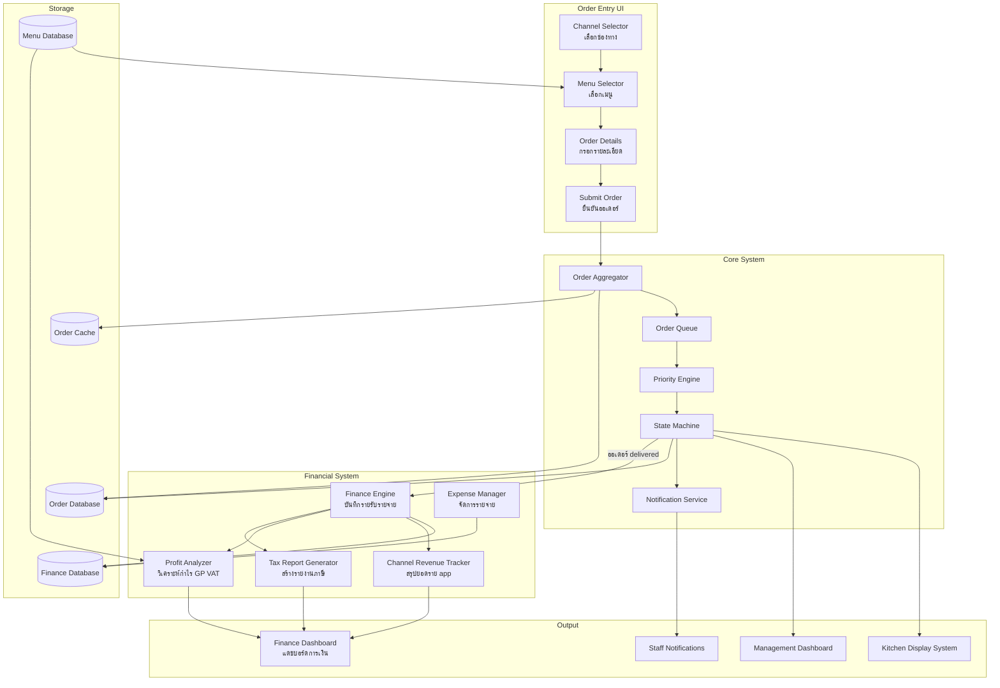
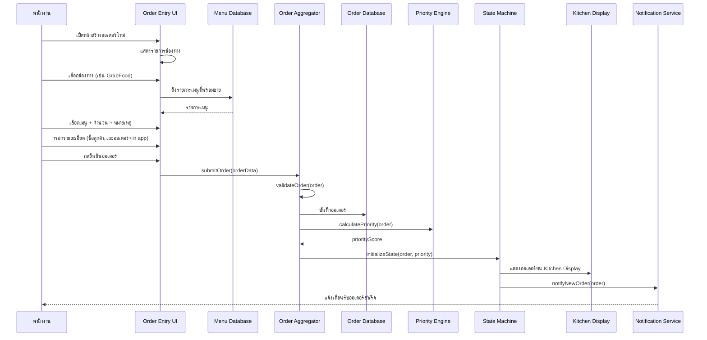
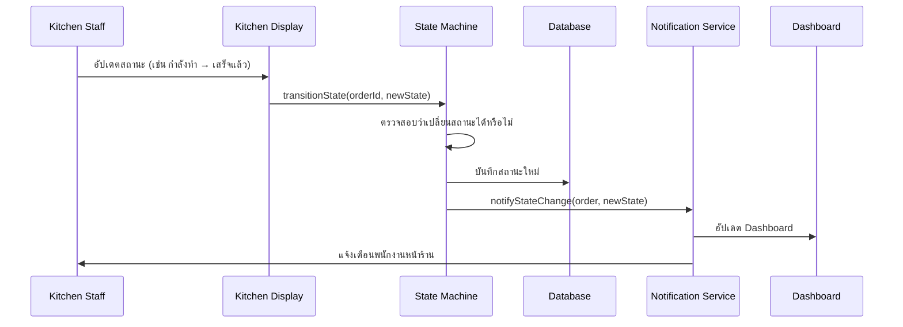
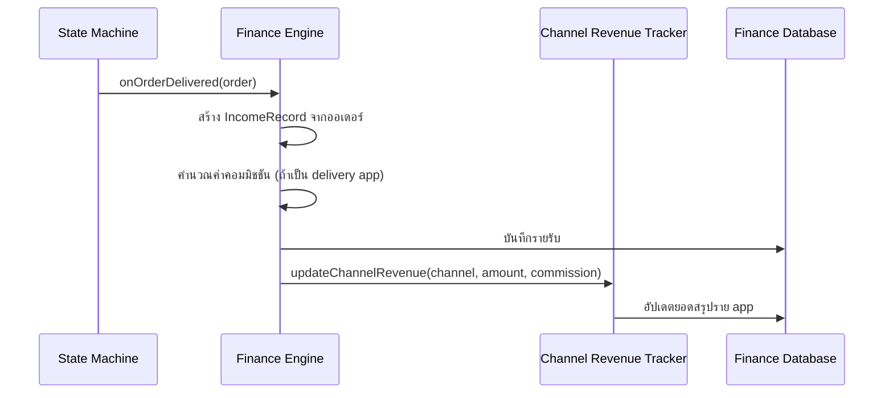
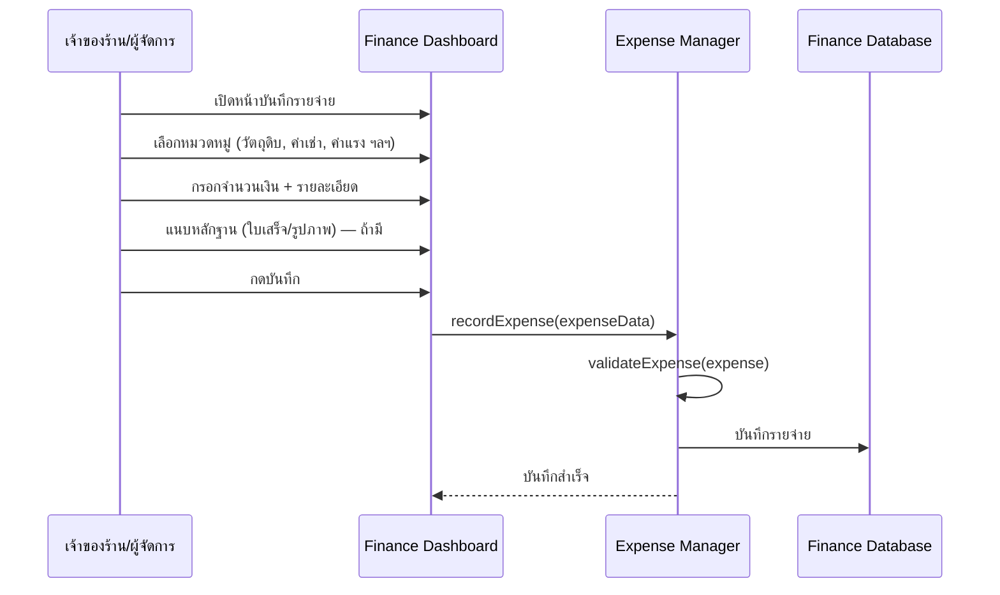
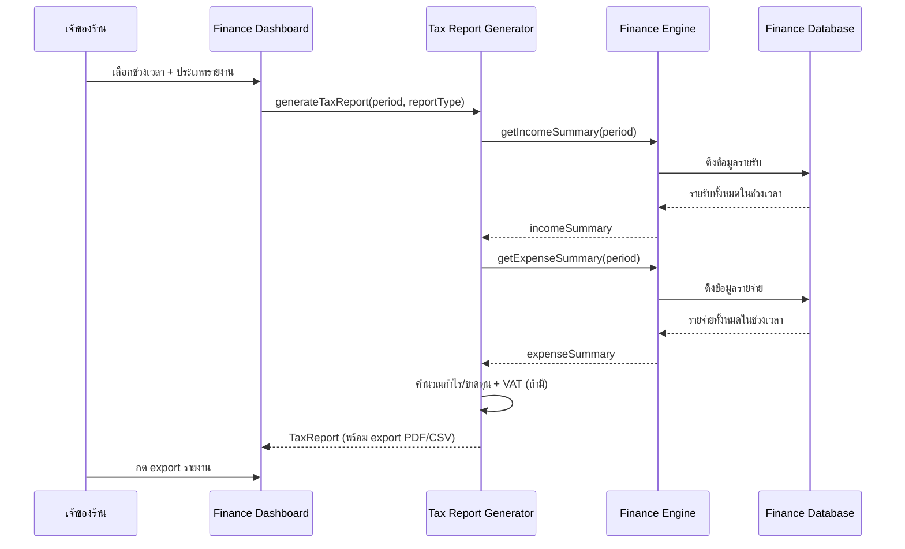
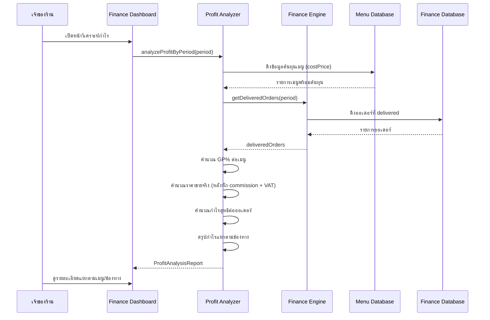

# Design Document: Restaurant Order Management

## Overview

ระบบจัดการออเดอร์ร้านอาหาร — ให้พนักงานกรอกออเดอร์จากทุกช่องทาง (GrabFood, LINE MAN, ShopeeFood, Walk-in, Website) เข้ามาในระบบเดียว ผ่านหน้าจอเดียว

ปัญหาที่แก้: ร้านอาหารต้องดูหลาย tablet/app พร้อมกัน ทำให้สับสนและล่าช้า ระบบนี้รวมทุกออเดอร์ไว้ที่เดียว จัดลำดับความสำคัญ และติดตามสถานะตั้งแต่รับออเดอร์จนส่งมอบ

ขั้นตอนหลัก: พนักงานเลือกช่องทาง → เลือกเมนู → กรอกรายละเอียด → ยืนยันออเดอร์ → ออเดอร์ไปแสดงที่ครัว

## Architecture

ระบบใช้สถาปัตยกรรมแบบ Event-Driven โดยมี Order Entry UI เป็นจุดเริ่มต้น ออเดอร์จะถูกส่งไปยัง Order Aggregator เพื่อตรวจสอบและบันทึก จากนั้นส่งต่อไปยัง Kitchen Display และ Dashboard



## Sequence Diagrams

### พนักงานรับออเดอร์ (Main Flow)



### อัปเดตสถานะออเดอร์



### บันทึกรายรับอัตโนมัติจากออเดอร์ (Auto Income Recording)



### บันทึกรายจ่ายด้วยมือ (Manual Expense Recording)



### สร้างรายงานภาษี (Tax Report Generation)



### วิเคราะห์กำไร GP และราคาขายจริง (Profit & GP Analysis)



## Components and Interfaces

### 1. Order Entry UI

หน้าจอสำหรับพนักงานกรอกออเดอร์ เริ่มจากเลือกช่องทาง แล้วเลือกเมนู

```typescript
interface OrderEntryUI {
  // ดึงรายการช่องทางที่รองรับ
  getAvailableChannels(): ChannelSource[]

  // ดึงรายการเมนูที่พร้อมขาย
  getMenuItems(): MenuItem[]

  // ค้นหาเมนู
  searchMenu(keyword: string): MenuItem[]

  // เพิ่มเมนูเข้าออเดอร์
  addItemToOrder(item: MenuItem, quantity: number, note?: string): void

  // ลบเมนูออกจากออเดอร์
  removeItemFromOrder(itemId: string): void

  // กรอกรายละเอียดออเดอร์
  setOrderDetails(details: OrderDetails): void

  // ยืนยันและส่งออเดอร์
  submitOrder(): Promise<OrderId | Error>

  // ล้างฟอร์มเริ่มใหม่
  resetForm(): void
}
```

ทำหน้าที่:
- แสดงช่องทาง (GrabFood, LINE MAN, ShopeeFood, Walk-in, Website) ให้เลือก
- ดึงเมนูจาก database แสดงให้เลือก รองรับค้นหา
- ให้กรอกจำนวน, หมายเหตุ, รายละเอียดออเดอร์
- ตรวจสอบข้อมูลเบื้องต้นก่อนส่ง (client-side validation)
- ส่งออเดอร์ไปยัง Order Aggregator

### 2. Order Aggregator

ศูนย์กลางรับและจัดการออเดอร์

```typescript
interface OrderAggregator {
  // รับออเดอร์ใหม่
  submitOrder(order: UnifiedOrder): Promise<OrderId | Error>

  // ดึงข้อมูลออเดอร์
  getOrder(orderId: string): Promise<UnifiedOrder | Error>

  // ดึงรายการออเดอร์ตาม filter
  listOrders(filter: OrderFilter): Promise<UnifiedOrder[]>

  // ยกเลิกออเดอร์
  cancelOrder(orderId: string, reason: string): Promise<void | Error>
}
```

ทำหน้าที่:
- รับออเดอร์จาก UI และตรวจสอบความถูกต้อง
- สร้าง Order ID ที่ไม่ซ้ำ
- บันทึกลง database
- ส่งต่อไปยัง Priority Engine และ State Machine

### 3. Priority Engine

คำนวณลำดับความสำคัญของออเดอร์

```typescript
interface PriorityEngine {
  // คำนวณคะแนนความสำคัญ
  calculatePriority(order: UnifiedOrder): PriorityScore

  // จัดเรียงออเดอร์ตามความสำคัญ
  reorderQueue(orders: UnifiedOrder[]): UnifiedOrder[]

  // ปรับความสำคัญด้วยมือ
  adjustPriority(orderId: string, adjustment: PriorityAdjustment): Promise<PriorityScore | Error>
}
```

ทำหน้าที่:
- คำนวณ Priority Score จากเวลาที่สั่ง, ประเภทช่องทาง, SLA
- จัดลำดับออเดอร์ในคิว
- ปรับ Priority ตามสถานการณ์ (เช่น ออเดอร์ใกล้หมดเวลา)

### 4. State Machine

จัดการ lifecycle ของออเดอร์

```typescript
interface OrderStateMachine {
  // เริ่มต้นสถานะออเดอร์ใหม่
  initializeState(order: UnifiedOrder, priority: PriorityScore): OrderState

  // เปลี่ยนสถานะ
  transitionState(orderId: string, newStatus: OrderStatus): Promise<OrderState | Error>

  // ดูสถานะปัจจุบัน
  getCurrentState(orderId: string): Promise<OrderState | Error>

  // ดูว่าเปลี่ยนไปสถานะไหนได้บ้าง
  getValidTransitions(status: OrderStatus): OrderStatus[]
}
```

ทำหน้าที่:
- จัดการการเปลี่ยนสถานะออเดอร์
- ตรวจสอบว่าเปลี่ยนสถานะได้หรือไม่ (valid transition)
- บันทึกประวัติการเปลี่ยนสถานะ
- แจ้งเตือนเมื่อสถานะเปลี่ยน

### 5. Menu Management

จัดการข้อมูลเมนูอาหาร

```typescript
interface MenuManagement {
  // ดึงเมนูทั้งหมด
  getAllMenuItems(): MenuItemTemplate[]

  // ดึงเมนูตามหมวดหมู่
  getMenuByCategory(category: string): MenuItemTemplate[]

  // ค้นหาเมนู
  searchMenu(keyword: string): MenuItemTemplate[]

  // เช็คว่าเมนูพร้อมขายหรือไม่
  getItemAvailability(itemId: string): boolean

  // เปิด/ปิดการขายเมนู
  updateAvailability(itemId: string, available: boolean): void
}
```

ทำหน้าที่:
- จัดเก็บรายการเมนูทั้งหมด
- จัดหมวดหมู่เมนู
- ตรวจสอบสถานะเมนู (พร้อมขาย/หมด)
- รองรับค้นหาเมนู

### 6. Finance Engine

ศูนย์กลางบันทึกรายรับรายจ่ายของร้าน — รายรับจากออเดอร์จะบันทึกอัตโนมัติเมื่อออเดอร์ delivered

```typescript
interface FinanceEngine {
  // บันทึกรายรับอัตโนมัติจากออเดอร์ที่ delivered
  recordIncomeFromOrder(order: UnifiedOrder): Promise<IncomeRecord | Error>

  // บันทึกรายรับด้วยมือ (กรณีรายรับอื่นๆ ที่ไม่ใช่ออเดอร์)
  recordManualIncome(income: ManualIncomeInput): Promise<IncomeRecord | Error>

  // ดึงสรุปรายรับตามช่วงเวลา
  getIncomeSummary(period: DatePeriod): Promise<IncomeSummary>

  // ดึงสรุปรายจ่ายตามช่วงเวลา
  getExpenseSummary(period: DatePeriod): Promise<ExpenseSummary>

  // ดึงสรุปกำไร/ขาดทุน
  getProfitLossSummary(period: DatePeriod): Promise<ProfitLossSummary>
}
```

ทำหน้าที่:
- รับ event จาก State Machine เมื่อออเดอร์เปลี่ยนเป็น `delivered` → สร้าง IncomeRecord อัตโนมัติ
- คำนวณค่าคอมมิชชันของแต่ละ delivery app
- รวมข้อมูลรายรับรายจ่ายสำหรับสร้างรายงาน

### 7. Expense Manager

จัดการบันทึกรายจ่ายของร้าน

```typescript
interface ExpenseManager {
  // บันทึกรายจ่าย
  recordExpense(expense: ExpenseInput): Promise<ExpenseRecord | Error>

  // ดึงรายจ่ายตาม filter
  listExpenses(filter: ExpenseFilter): Promise<ExpenseRecord[]>

  // แก้ไขรายจ่าย
  updateExpense(expenseId: string, updates: Partial<ExpenseInput>): Promise<ExpenseRecord | Error>

  // ลบรายจ่าย
  deleteExpense(expenseId: string): Promise<void | Error>

  // ดึงหมวดหมู่รายจ่ายทั้งหมด
  getExpenseCategories(): ExpenseCategory[]
}
```

ทำหน้าที่:
- ให้เจ้าของร้าน/ผู้จัดการบันทึกรายจ่ายด้วยมือ
- จัดหมวดหมู่รายจ่าย (วัตถุดิบ, ค่าเช่า, ค่าน้ำค่าไฟ, ค่าแรง ฯลฯ)
- รองรับแนบหลักฐาน (ใบเสร็จ/รูปภาพ)
- แก้ไข/ลบรายจ่ายที่บันทึกผิดได้

### 8. Channel Revenue Tracker

สรุปยอดรายรับแยกตาม delivery app/ช่องทาง

```typescript
interface ChannelRevenueTracker {
  // ดึงสรุปยอดแยกตามช่องทาง
  getRevenueByChannel(period: DatePeriod): Promise<ChannelRevenueSummary[]>

  // ดึงรายละเอียดยอดของช่องทางใดช่องทางหนึ่ง
  getChannelDetail(channel: ChannelSource, period: DatePeriod): Promise<ChannelRevenueDetail>

  // เปรียบเทียบยอดระหว่างช่องทาง
  compareChannels(period: DatePeriod): Promise<ChannelComparison>
}
```

ทำหน้าที่:
- สรุปยอดขายแยกตาม GrabFood, LINE MAN, ShopeeFood, Walk-in, Website
- คำนวณค่าคอมมิชชันที่ถูกหักจากแต่ละ app
- แสดงยอดสุทธิ (หลังหักค่าคอมมิชชัน) ของแต่ละช่องทาง
- เปรียบเทียบ performance ระหว่างช่องทาง

### 9. Tax Report Generator

สร้างรายงานสำหรับนำส่งภาษี

```typescript
interface TaxReportGenerator {
  // สร้างรายงานภาษี
  generateTaxReport(period: DatePeriod, type: TaxReportType): Promise<TaxReport>

  // สร้างรายงานสรุปรายรับรายจ่าย (ภ.ง.ด.)
  generateIncomeExpenseReport(period: DatePeriod): Promise<IncomeExpenseReport>

  // คำนวณ VAT (ถ้าร้านจด VAT)
  calculateVAT(period: DatePeriod): Promise<VATSummary | null>

  // Export รายงานเป็น PDF หรือ CSV
  exportReport(report: TaxReport, format: ExportFormat): Promise<ExportedFile>
}
```

ทำหน้าที่:
- สร้างรายงานสรุปรายรับรายจ่ายตามรูปแบบที่ใช้ยื่นภาษี
- รองรับรายงานรายเดือน, รายปี
- คำนวณ VAT สำหรับร้านที่จดทะเบียนภาษีมูลค่าเพิ่ม
- Export เป็น PDF (สำหรับพิมพ์) หรือ CSV/Excel (สำหรับนำไปใช้ต่อ)

### 10. Profit Analyzer

วิเคราะห์กำไร GP ราคาขายจริง และกำไรสุทธิ — ช่วยเจ้าของร้านเข้าใจว่าขายแต่ละเมนู/ช่องทางได้กำไรจริงเท่าไหร่

```typescript
interface ProfitAnalyzer {
  // คำนวณ GP% ของเมนูแต่ละรายการ
  calculateItemGP(item: MenuItem): ItemProfitAnalysis

  // คำนวณราคาขายจริงที่ร้านได้รับ (หลังหัก commission + VAT)
  calculateActualSellingPrice(
    order: UnifiedOrder,
    commissionRate: number,
    isVATRegistered: boolean
  ): number

  // วิเคราะห์กำไรต่อออเดอร์
  analyzeOrderProfit(
    order: UnifiedOrder,
    commissionRate: number,
    isVATRegistered: boolean
  ): OrderProfitAnalysis

  // วิเคราะห์กำไรแยกตามช่องทาง
  analyzeChannelProfit(
    orders: UnifiedOrder[],
    commissionRates: Record<ChannelSource, number>,
    isVATRegistered: boolean,
    period: DatePeriod
  ): ChannelProfitAnalysis[]

  // สร้างรายงานวิเคราะห์กำไรรวม
  generateProfitReport(
    orders: UnifiedOrder[],
    commissionRates: Record<ChannelSource, number>,
    isVATRegistered: boolean,
    period: DatePeriod
  ): ProfitAnalysisReport

  // ดึงเมนูที่ GP% ต่ำกว่าเกณฑ์ (แนะนำให้ปรับปรุง)
  getLowGPItems(threshold: number, period: DatePeriod): ItemProfitAnalysis[]

  // เปรียบเทียบราคาขายจริงระหว่างช่องทาง
  compareActualSellingPriceByChannel(
    orders: UnifiedOrder[],
    commissionRates: Record<ChannelSource, number>,
    isVATRegistered: boolean,
    period: DatePeriod
  ): ChannelProfitAnalysis[]
}
```

ทำหน้าที่:
- คำนวณ GP% ของแต่ละเมนู จากราคาขายและต้นทุน
- คำนวณราคาขายจริงที่ร้านได้รับหลังหักค่าคอมมิชชันและ VAT
- วิเคราะห์กำไรสุทธิต่อออเดอร์ ต่อช่องทาง
- แจ้งเตือนเมนูที่ GP% ต่ำ ควรปรับราคาหรือลดต้นทุน
- เปรียบเทียบกำไรจริงระหว่างช่องทาง (ช่วยตัดสินใจว่าควรเน้นช่องทางไหน)

## Data Models

### ChannelSource — ช่องทางที่ออเดอร์มาจาก

```typescript
type ChannelSource = "grabFood" | "lineMan" | "shopeeFood" | "walkIn" | "website"
```

### OrderStatus — สถานะของออเดอร์

```typescript
type OrderStatus = "received" | "confirmed" | "preparing" | "ready" | "pickedUp" | "delivered" | "cancelled"
```

### MenuItem — รายการอาหารในออเดอร์

```typescript
interface MenuItem {
  itemId: string
  name: string
  quantity: number        // จำนวน (ต้อง > 0)
  unitPrice: number       // ราคาขาย (ต้อง >= 0)
  costPrice: number       // ต้นทุนต่อหน่วย (ต้อง >= 0)
  specialInstructions?: string  // หมายเหตุพิเศษ เช่น "เผ็ดมาก"
}
```

### OrderDetails — รายละเอียดเพิ่มเติมที่พนักงานกรอก

```typescript
interface OrderDetails {
  customerName?: string
  customerPhone?: string
  deliveryAddress?: string
  externalOrderId?: string  // เลขออเดอร์จาก app ต้นทาง เช่น "GRAB-ABC123"
  notes?: string
}
```

### UnifiedOrder — ออเดอร์หลักของระบบ

```typescript
interface UnifiedOrder {
  orderId: string              // ระบบสร้างให้อัตโนมัติ
  channel: ChannelSource       // ช่องทาง (พนักงานเลือก)
  externalOrderId?: string     // เลขออเดอร์จาก app (ถ้ามี)
  items: MenuItem[]            // รายการอาหาร (ต้องมีอย่างน้อย 1 รายการ)
  totalAmount: number          // ยอดรวมราคาขาย (คำนวณอัตโนมัติจาก items)
  totalCost: number            // ต้นทุนรวม (คำนวณอัตโนมัติจาก items)
  customerName?: string
  customerPhone?: string
  deliveryAddress?: string
  orderTime: number            // Unix timestamp ตอนสร้างออเดอร์
  estimatedPickupTime?: number // เวลาที่คาดว่าจะมารับ
  status: OrderStatus          // สถานะปัจจุบัน
  priorityScore: number        // คะแนนความสำคัญ
  notes?: string
  enteredBy: string            // พนักงานที่กรอกออเดอร์ (ต้องไม่ว่าง)
}
```

กฎ Validation:
- `orderId` — ต้องไม่ว่าง, ไม่ซ้ำ (ระบบสร้างให้)
- `channel` — ต้องเลือกก่อนเสมอ (step แรก)
- `items` — ต้องมีอย่างน้อย 1 รายการ
- `totalAmount` — ต้อง > 0 (คำนวณจาก items อัตโนมัติ: ผลรวม unitPrice × quantity)
- `totalCost` — ต้อง >= 0 (คำนวณจาก items อัตโนมัติ: ผลรวม costPrice × quantity)
- `quantity` ของแต่ละ item — ต้อง > 0
- `unitPrice` — ต้อง >= 0
- `costPrice` — ต้อง >= 0
- `enteredBy` — ต้องไม่ว่าง (ได้จาก login session)
- `externalOrderId` — ไม่บังคับ แต่แนะนำให้กรอกสำหรับออเดอร์จาก delivery app

### MenuItemTemplate — เมนูในระบบ

```typescript
interface MenuItemTemplate {
  itemId: string
  name: string
  category: string
  unitPrice: number       // ราคาขาย
  costPrice: number       // ต้นทุน
  isAvailable: boolean
  description?: string
}
```

### OrderState — สถานะและประวัติของออเดอร์

```typescript
interface StateTransition {
  fromStatus: OrderStatus
  toStatus: OrderStatus
  timestamp: number
  actor: string          // พนักงานที่เปลี่ยนสถานะ
  reason?: string
}

interface OrderState {
  orderId: string
  currentStatus: OrderStatus
  history: StateTransition[]
  createdAt: number
  updatedAt: number
}
```

### PriorityScore — คะแนนความสำคัญ

```typescript
interface PriorityScore {
  score: number
  factors: PriorityFactor[]
}

type PriorityFactor =
  | { type: "channelSLA"; deadline: number }
  | { type: "waitTime"; minutes: number }
  | { type: "orderSize"; itemCount: number }
  | { type: "rushHourBoost"; multiplier: number }
```

### TransactionType — ประเภทรายการทางการเงิน

```typescript
type TransactionType = "income" | "expense"
```

### IncomeSource — แหล่งที่มาของรายรับ

```typescript
type IncomeSource = "order" | "manual"  // order = จากออเดอร์อัตโนมัติ, manual = กรอกเอง
```

### ExpenseCategoryType — หมวดหมู่รายจ่าย

```typescript
type ExpenseCategoryType =
  | "ingredients"      // วัตถุดิบ
  | "rent"             // ค่าเช่า
  | "utilities"        // ค่าน้ำ ค่าไฟ
  | "staffWages"       // ค่าแรงพนักงาน
  | "equipment"        // อุปกรณ์
  | "marketing"        // การตลาด
  | "packaging"        // บรรจุภัณฑ์
  | "delivery"         // ค่าจัดส่ง
  | "maintenance"      // ซ่อมบำรุง
  | "other"            // อื่นๆ
```

### ExpenseCategory — หมวดหมู่รายจ่าย (พร้อมชื่อแสดงผล)

```typescript
interface ExpenseCategory {
  type: ExpenseCategoryType
  label: string          // ชื่อแสดงผลภาษาไทย เช่น "วัตถุดิบ"
}
```

### IncomeRecord — บันทึกรายรับ

```typescript
interface IncomeRecord {
  recordId: string
  type: "income"
  source: IncomeSource
  orderId?: string              // ถ้ามาจากออเดอร์ — link กลับไปหาออเดอร์ได้
  channel?: ChannelSource       // ช่องทางที่ขาย
  grossAmount: number           // ยอดรวมก่อนหักค่าคอมมิชชัน
  commissionRate: number        // อัตราค่าคอมมิชชัน (0-1) เช่น 0.30 = 30%
  commissionAmount: number      // จำนวนเงินค่าคอมมิชชัน
  netAmount: number             // ยอดสุทธิหลังหักค่าคอมมิชชัน
  vatAmount: number             // จำนวน VAT (0 ถ้าไม่ได้จด VAT)
  description: string
  recordedAt: number            // Unix timestamp
  recordedBy: string            // พนักงานที่บันทึก
}
```

กฎ Validation:
- `grossAmount` ต้อง > 0
- `commissionRate` ต้องอยู่ระหว่าง 0 ถึง 1
- `commissionAmount` = `grossAmount` × `commissionRate`
- `netAmount` = `grossAmount` - `commissionAmount`
- ถ้า `source` = "order" ต้องมี `orderId` และ `channel`
- `vatAmount` = `grossAmount` × 7/107 (ถ้าร้านจด VAT — แยก VAT จากราคารวม), 0 ถ้าไม่ได้จด

### ManualIncomeInput — ข้อมูลสำหรับบันทึกรายรับด้วยมือ

```typescript
interface ManualIncomeInput {
  amount: number
  description: string
  date: number                  // วันที่เกิดรายรับ
  receiptUrl?: string           // URL หลักฐาน (ถ้ามี)
}
```

### ExpenseInput — ข้อมูลสำหรับบันทึกรายจ่าย

```typescript
interface ExpenseInput {
  category: ExpenseCategoryType
  amount: number
  description: string
  date: number                  // วันที่เกิดรายจ่าย
  receiptUrl?: string           // URL ใบเสร็จ/หลักฐาน (ถ้ามี)
  vendor?: string               // ชื่อร้านค้า/ผู้ขาย
  isRecurring: boolean          // เป็นรายจ่ายประจำหรือไม่ (เช่น ค่าเช่ารายเดือน)
}
```

### ExpenseRecord — บันทึกรายจ่าย

```typescript
interface ExpenseRecord {
  recordId: string
  type: "expense"
  category: ExpenseCategoryType
  amount: number                // จำนวนเงิน (ต้อง > 0)
  vatAmount: number             // VAT ที่จ่ายไป (ใช้เป็น VAT ซื้อ)
  description: string
  date: number
  receiptUrl?: string
  vendor?: string
  isRecurring: boolean
  recordedAt: number
  recordedBy: string
}
```

กฎ Validation:
- `amount` ต้อง > 0
- `category` ต้องเป็นค่าใน `ExpenseCategoryType`
- `description` ต้องไม่ว่าง
- `recordedBy` ต้องไม่ว่าง

### ExpenseFilter — ตัวกรองรายจ่าย

```typescript
interface ExpenseFilter {
  category?: ExpenseCategoryType
  startDate?: number
  endDate?: number
  minAmount?: number
  maxAmount?: number
  vendor?: string
  isRecurring?: boolean
}
```

### DatePeriod — ช่วงเวลาสำหรับรายงาน

```typescript
interface DatePeriod {
  startDate: number             // Unix timestamp เริ่มต้น
  endDate: number               // Unix timestamp สิ้นสุด
  periodType: "daily" | "weekly" | "monthly" | "yearly"
}
```

### ChannelCommissionRate — อัตราค่าคอมมิชชันของแต่ละ app

```typescript
// อัตราค่าคอมมิชชันเริ่มต้น (ปรับได้ตามสัญญาจริงของร้าน)
const defaultCommissionRates: Record<ChannelSource, number> = {
  grabFood: 0.30,       // GrabFood หัก 30%
  lineMan: 0.30,        // LINE MAN หัก 30%
  shopeeFood: 0.25,     // ShopeeFood หัก 25%
  walkIn: 0,            // Walk-in ไม่มีค่าคอมมิชชัน
  website: 0,           // Website ไม่มีค่าคอมมิชชัน
}
```

### ChannelRevenueSummary — สรุปยอดรายรับแยกตามช่องทาง

```typescript
interface ChannelRevenueSummary {
  channel: ChannelSource
  period: DatePeriod
  totalOrders: number           // จำนวนออเดอร์
  grossRevenue: number          // ยอดรวมก่อนหักค่าคอมมิชชัน
  totalCommission: number       // ค่าคอมมิชชันรวม
  netRevenue: number            // ยอดสุทธิหลังหักค่าคอมมิชชัน
  averageOrderValue: number     // ยอดเฉลี่ยต่อออเดอร์
}
```

### ChannelRevenueDetail — รายละเอียดยอดของช่องทาง

```typescript
interface ChannelRevenueDetail {
  channel: ChannelSource
  period: DatePeriod
  summary: ChannelRevenueSummary
  dailyBreakdown: DailyRevenue[]  // ยอดรายวัน
  topSellingItems: TopSellingItem[] // เมนูขายดีของช่องทางนี้
}

interface DailyRevenue {
  date: number
  orderCount: number
  grossRevenue: number
  netRevenue: number
}

interface TopSellingItem {
  itemId: string
  name: string
  totalQuantity: number
  totalRevenue: number
}
```

### ChannelComparison — เปรียบเทียบระหว่างช่องทาง

```typescript
interface ChannelComparison {
  period: DatePeriod
  channels: ChannelRevenueSummary[]
  bestChannel: ChannelSource          // ช่องทางที่ยอดสุทธิสูงสุด
  totalGrossRevenue: number
  totalNetRevenue: number
  totalCommissionPaid: number
}
```

### IncomeSummary / ExpenseSummary — สรุปรายรับรายจ่าย

```typescript
interface IncomeSummary {
  period: DatePeriod
  totalGrossIncome: number
  totalCommission: number
  totalNetIncome: number
  totalVAT: number
  byChannel: ChannelRevenueSummary[]
  manualIncomeTotal: number
}

interface ExpenseSummary {
  period: DatePeriod
  totalExpenses: number
  totalVATInput: number             // VAT ซื้อรวม
  byCategory: CategoryExpenseSummary[]
}

interface CategoryExpenseSummary {
  category: ExpenseCategoryType
  label: string
  totalAmount: number
  transactionCount: number
  percentage: number                // สัดส่วนของรายจ่ายทั้งหมด (0-100)
}
```

### ProfitLossSummary — สรุปกำไร/ขาดทุน

```typescript
interface ProfitLossSummary {
  period: DatePeriod
  totalNetIncome: number            // รายรับสุทธิ (หลังหักค่าคอมมิชชัน)
  totalExpenses: number             // รายจ่ายรวม
  grossProfit: number               // กำไรขั้นต้น = รายรับสุทธิ - รายจ่าย
  vatPayable: number                // VAT ที่ต้องจ่าย = VAT ขาย - VAT ซื้อ (ถ้าจด VAT)
  netProfit: number                 // กำไรสุทธิ
}
```

### TaxReportType / ExportFormat — ประเภทรายงานภาษีและรูปแบบ export

```typescript
type TaxReportType =
  | "monthly"           // รายงานรายเดือน
  | "yearly"            // รายงานรายปี (สำหรับ ภ.ง.ด.)
  | "vat"               // รายงาน VAT (ภ.พ.30)

type ExportFormat = "pdf" | "csv" | "xlsx"
```

### TaxReport — รายงานภาษี

```typescript
interface TaxReport {
  reportId: string
  type: TaxReportType
  period: DatePeriod
  generatedAt: number
  income: IncomeSummary
  expenses: ExpenseSummary
  profitLoss: ProfitLossSummary
  vatSummary: VATSummary | null     // null ถ้าร้านไม่ได้จด VAT
}
```

### VATSummary — สรุป VAT

```typescript
interface VATSummary {
  period: DatePeriod
  vatRate: number                   // อัตรา VAT (0.07 = 7%)
  outputVAT: number                 // VAT ขาย (จากรายรับ)
  inputVAT: number                  // VAT ซื้อ (จากรายจ่าย)
  netVAT: number                    // VAT ที่ต้องนำส่ง = outputVAT - inputVAT
  isRegistered: boolean             // ร้านจด VAT หรือไม่
}
```

### IncomeExpenseReport — รายงานรายรับรายจ่าย (สำหรับยื่นภาษี)

```typescript
interface IncomeExpenseReport {
  period: DatePeriod
  businessName: string
  taxId: string                     // เลขประจำตัวผู้เสียภาษี
  incomeItems: IncomeRecord[]
  expenseItems: ExpenseRecord[]
  summary: ProfitLossSummary
  generatedAt: number
}
```

### ExportedFile — ไฟล์ที่ export ออกมา

```typescript
interface ExportedFile {
  fileName: string
  format: ExportFormat
  fileUrl: string                   // URL สำหรับดาวน์โหลด
  fileSize: number                  // ขนาดไฟล์ (bytes)
  generatedAt: number
}
```

### ItemProfitAnalysis — วิเคราะห์กำไรต่อเมนู

```typescript
interface ItemProfitAnalysis {
  itemId: string
  name: string
  category: string
  unitPrice: number                 // ราคาขาย
  costPrice: number                 // ต้นทุน
  gpPercentage: number              // GP% = (unitPrice - costPrice) / unitPrice × 100
  grossProfitPerUnit: number        // กำไรขั้นต้นต่อหน่วย = unitPrice - costPrice
  totalQuantitySold: number         // จำนวนที่ขายได้ในช่วงเวลา
  totalRevenue: number              // ยอดขายรวม = unitPrice × totalQuantitySold
  totalCost: number                 // ต้นทุนรวม = costPrice × totalQuantitySold
  totalGrossProfit: number          // กำไรขั้นต้นรวม = totalRevenue - totalCost
}
```

กฎ Validation:
- `gpPercentage` = (`unitPrice` - `costPrice`) / `unitPrice` × 100 (ถ้า `unitPrice` > 0)
- `gpPercentage` ต้องอยู่ระหว่าง -∞ ถึง 100 (ติดลบได้ถ้าขายต่ำกว่าทุน)
- `grossProfitPerUnit` = `unitPrice` - `costPrice`
- `totalGrossProfit` = `grossProfitPerUnit` × `totalQuantitySold`

### OrderProfitAnalysis — วิเคราะห์กำไรต่อออเดอร์

```typescript
interface OrderProfitAnalysis {
  orderId: string
  channel: ChannelSource
  items: ItemProfitAnalysis[]
  totalSellingPrice: number         // ราคาขายรวม (ยอดออเดอร์)
  totalCostPrice: number            // ต้นทุนรวมของออเดอร์
  grossProfit: number               // กำไรขั้นต้น = totalSellingPrice - totalCostPrice
  gpPercentage: number              // GP% ของออเดอร์
  commissionAmount: number          // ค่าคอมมิชชัน (ถ้าเป็น delivery app)
  vatAmount: number                 // VAT (ถ้าจด VAT)
  actualSellingPrice: number        // ราคาขายจริงที่ร้านได้รับ
  netProfit: number                 // กำไรสุทธิ = actualSellingPrice - totalCostPrice
  netProfitMargin: number           // Net Profit Margin % = netProfit / totalSellingPrice × 100
}
```

กฎ Validation:
- `grossProfit` = `totalSellingPrice` - `totalCostPrice`
- `gpPercentage` = `grossProfit` / `totalSellingPrice` × 100 (ถ้า `totalSellingPrice` > 0)
- สำหรับ delivery app: `actualSellingPrice` = `totalSellingPrice` - `commissionAmount` - `vatAmount`
- สำหรับ walk-in/website: `actualSellingPrice` = `totalSellingPrice` - `vatAmount` (ถ้าจด VAT)
- `netProfit` = `actualSellingPrice` - `totalCostPrice`
- `netProfitMargin` = `netProfit` / `totalSellingPrice` × 100

### ChannelProfitAnalysis — วิเคราะห์กำไรแยกตามช่องทาง

```typescript
interface ChannelProfitAnalysis {
  channel: ChannelSource
  period: DatePeriod
  totalOrders: number               // จำนวนออเดอร์
  totalSellingPrice: number         // ยอดขายรวม
  totalCostPrice: number            // ต้นทุนรวม
  totalGrossProfit: number          // กำไรขั้นต้นรวม
  averageGPPercentage: number       // GP% เฉลี่ย
  totalCommission: number           // ค่าคอมมิชชันรวม
  totalVAT: number                  // VAT รวม
  totalActualSellingPrice: number   // ราคาขายจริงรวมที่ร้านได้รับ
  totalNetProfit: number            // กำไรสุทธิรวม
  netProfitMargin: number           // Net Profit Margin %
  topProfitItems: ItemProfitAnalysis[]  // เมนูที่กำไรสูงสุด
  lowGPItems: ItemProfitAnalysis[]      // เมนูที่ GP% ต่ำ (ควรปรับปรุง)
}
```

กฎ Validation:
- `totalGrossProfit` = `totalSellingPrice` - `totalCostPrice`
- `totalActualSellingPrice` = `totalSellingPrice` - `totalCommission` - `totalVAT`
- `totalNetProfit` = `totalActualSellingPrice` - `totalCostPrice`
- `netProfitMargin` = `totalNetProfit` / `totalSellingPrice` × 100

### ProfitAnalysisReport — รายงานวิเคราะห์กำไรรวม

```typescript
interface ProfitAnalysisReport {
  period: DatePeriod
  byItem: ItemProfitAnalysis[]              // วิเคราะห์แยกตามเมนู
  byCategory: CategoryProfitSummary[]       // วิเคราะห์แยกตามหมวดหมู่
  byChannel: ChannelProfitAnalysis[]        // วิเคราะห์แยกตามช่องทาง
  overall: OverallProfitSummary             // สรุปรวมทั้งหมด
}

interface CategoryProfitSummary {
  category: string
  totalRevenue: number
  totalCost: number
  totalGrossProfit: number
  averageGPPercentage: number
  itemCount: number
}

interface OverallProfitSummary {
  totalSellingPrice: number
  totalCostPrice: number
  totalGrossProfit: number
  overallGPPercentage: number               // GP% รวม
  totalCommission: number
  totalVAT: number
  totalActualSellingPrice: number
  totalNetProfit: number
  overallNetProfitMargin: number            // Net Profit Margin % รวม
  bestProfitChannel: ChannelSource          // ช่องทางที่กำไรสุทธิสูงสุด
  bestGPItem: string                        // เมนูที่ GP% สูงสุด
  worstGPItem: string                       // เมนูที่ GP% ต่ำสุด
}
```

## ขั้นตอนการทำงานหลัก

### 1. การสร้างออเดอร์ (Manual Order Entry)

พนักงานสร้างออเดอร์ผ่าน UI ตามขั้นตอนนี้:

1. พนักงานเปิดหน้าสร้างออเดอร์ → ระบบแสดงรายการช่องทาง
2. พนักงานเลือกช่องทาง (เช่น GrabFood, Walk-in) → ระบบดึงเมนูมาแสดง
3. พนักงานเลือกเมนู กรอกจำนวน และหมายเหตุพิเศษ
4. พนักงานกรอกรายละเอียดเพิ่มเติม (ชื่อลูกค้า, เลขออเดอร์จาก app)
5. พนักงานกดยืนยัน → ระบบตรวจสอบข้อมูล → บันทึก → ส่งไปครัว

### 2. การตรวจสอบออเดอร์ (Validation)

เมื่อพนักงานกดยืนยัน ระบบจะตรวจสอบ:

```typescript
function validateOrder(order: UnifiedOrder): UnifiedOrder | Error {
  if (order.items.length === 0) return Error("ออเดอร์ต้องมีอย่างน้อย 1 รายการ")
  if (order.totalAmount <= 0) return Error("ยอดรวมต้องมากกว่า 0")
  if (order.items.some(item => item.quantity <= 0)) return Error("จำนวนสินค้าต้องมากกว่า 0")
  if (!order.enteredBy) return Error("ต้องระบุพนักงานที่กรอกออเดอร์")
  return order
}
```

### 3. การคำนวณ Priority

ระบบคำนวณคะแนนความสำคัญจากปัจจัยเหล่านี้:

```typescript
// น้ำหนักของแต่ละช่องทาง (delivery app มี SLA เข้มงวดกว่า)
const channelWeight: Record<ChannelSource, number> = {
  grabFood: 1.2,
  lineMan: 1.2,
  shopeeFood: 1.1,
  walkIn: 1.0,
  website: 0.9,
}

function computePriorityScore(order: UnifiedOrder, currentTime: number): PriorityScore {
  const waitMinutes = (currentTime - order.orderTime) / 60
  const baseScore =
    waitMinutes * 0.5 +                    // ยิ่งรอนาน ยิ่งสำคัญ
    channelWeight[order.channel] * 20 +     // delivery app สำคัญกว่า
    order.items.length * 2                  // ออเดอร์ใหญ่ใช้เวลาทำนาน

  // ช่วง rush hour (11:00-13:00, 17:00-20:00) คูณ 1.3
  const hour = Math.floor(currentTime / 3600) % 24
  const isRushHour = (hour >= 11 && hour <= 13) || (hour >= 17 && hour <= 20)
  const rushMultiplier = isRushHour ? 1.3 : 1.0

  return {
    score: baseScore * rushMultiplier,
    factors: [
      { type: "waitTime", minutes: waitMinutes },
      { type: "channelSLA", deadline: order.estimatedPickupTime ?? order.orderTime + 1800 },
      { type: "orderSize", itemCount: order.items.length },
      { type: "rushHourBoost", multiplier: rushMultiplier },
    ],
  }
}
```

### 4. การเปลี่ยนสถานะออเดอร์ (State Transition)

สถานะเปลี่ยนได้ตามเส้นทางนี้เท่านั้น:

```
received → confirmed → preparing → ready → pickedUp → delivered
    ↓          ↓           ↓         ↓
 cancelled  cancelled   cancelled  cancelled
```

```typescript
// กำหนดว่าแต่ละสถานะเปลี่ยนไปสถานะไหนได้บ้าง
const validTransitions: Record<OrderStatus, OrderStatus[]> = {
  received:  ["confirmed", "cancelled"],
  confirmed: ["preparing", "cancelled"],
  preparing: ["ready", "cancelled"],
  ready:     ["pickedUp", "cancelled"],
  pickedUp:  ["delivered"],
  delivered: [],    // สถานะสุดท้าย — เปลี่ยนต่อไม่ได้
  cancelled: [],    // สถานะสุดท้าย — เปลี่ยนต่อไม่ได้
}

function transitionOrderState(
  state: OrderState,
  newStatus: OrderStatus,
  actor: string,
  currentTime: number,
  reason?: string
): OrderState | Error {
  // ตรวจสอบว่าเปลี่ยนได้หรือไม่
  if (!validTransitions[state.currentStatus].includes(newStatus)) {
    return Error(`ไม่สามารถเปลี่ยนจาก ${state.currentStatus} เป็น ${newStatus} ได้`)
  }

  // บันทึกประวัติและอัปเดตสถานะ
  return {
    ...state,
    currentStatus: newStatus,
    updatedAt: currentTime,
    history: [...state.history, {
      fromStatus: state.currentStatus,
      toStatus: newStatus,
      timestamp: currentTime,
      actor,
      reason,
    }],
  }
}
```

### 5. การสร้าง Order Object

```typescript
function buildOrder(
  channel: ChannelSource,
  items: MenuItem[],
  details: OrderDetails,
  staffId: string,
  currentTime: number,
  orderId: string
): UnifiedOrder {
  const totalAmount = items.reduce((sum, item) => sum + item.unitPrice * item.quantity, 0)
  const totalCost = items.reduce((sum, item) => sum + item.costPrice * item.quantity, 0)

  return {
    orderId,
    channel,
    externalOrderId: details.externalOrderId,
    items,
    totalAmount,
    totalCost,
    customerName: details.customerName,
    customerPhone: details.customerPhone,
    deliveryAddress: details.deliveryAddress,
    orderTime: currentTime,
    status: "received",
    priorityScore: 0,
    notes: details.notes,
    enteredBy: staffId,
  }
}
```

### 6. การบันทึกรายรับจากออเดอร์ (Auto Income Recording)

เมื่อออเดอร์เปลี่ยนสถานะเป็น `delivered` ระบบจะบันทึกรายรับอัตโนมัติ:

```typescript
// อัตราค่าคอมมิชชันเริ่มต้น (ปรับได้ตามสัญญาจริง)
const defaultCommissionRates: Record<ChannelSource, number> = {
  grabFood: 0.30,
  lineMan: 0.30,
  shopeeFood: 0.25,
  walkIn: 0,
  website: 0,
}

function createIncomeFromOrder(
  order: UnifiedOrder,
  commissionRates: Record<ChannelSource, number>,
  isVATRegistered: boolean,
  currentTime: number,
  recordId: string
): IncomeRecord {
  const rate = commissionRates[order.channel]
  const commissionAmount = order.totalAmount * rate
  const netAmount = order.totalAmount - commissionAmount
  // VAT แยกจากราคารวม VAT: ราคารวม × 7/107
  const vatAmount = isVATRegistered ? order.totalAmount * (7 / 107) : 0

  return {
    recordId,
    type: "income",
    source: "order",
    orderId: order.orderId,
    channel: order.channel,
    grossAmount: order.totalAmount,
    commissionRate: rate,
    commissionAmount,
    netAmount,
    vatAmount,
    description: `รายรับจากออเดอร์ ${order.orderId} (${order.channel})`,
    recordedAt: currentTime,
    recordedBy: "system",  // บันทึกอัตโนมัติ
  }
}
```

### 7. การบันทึกรายจ่าย (Expense Recording)

```typescript
function validateExpense(expense: ExpenseInput): ExpenseInput | Error {
  if (expense.amount <= 0) return Error("จำนวนเงินต้องมากกว่า 0")
  if (!expense.description.trim()) return Error("กรุณากรอกรายละเอียด")
  if (!expense.category) return Error("กรุณาเลือกหมวดหมู่")
  return expense
}

function createExpenseRecord(
  input: ExpenseInput,
  isVATRegistered: boolean,
  staffId: string,
  currentTime: number,
  recordId: string
): ExpenseRecord {
  const vatAmount = isVATRegistered ? input.amount * 0.07 : 0

  return {
    recordId,
    type: "expense",
    category: input.category,
    amount: input.amount,
    vatAmount,
    description: input.description,
    date: input.date,
    receiptUrl: input.receiptUrl,
    vendor: input.vendor,
    isRecurring: input.isRecurring,
    recordedAt: currentTime,
    recordedBy: staffId,
  }
}
```

### 8. การสรุปยอดราย Application (Channel Revenue Summary)

```typescript
function computeChannelRevenue(
  incomeRecords: IncomeRecord[],
  channel: ChannelSource,
  period: DatePeriod
): ChannelRevenueSummary {
  const channelRecords = incomeRecords.filter(
    r => r.channel === channel &&
         r.source === "order" &&
         r.recordedAt >= period.startDate &&
         r.recordedAt <= period.endDate
  )

  const totalOrders = channelRecords.length
  const grossRevenue = channelRecords.reduce((sum, r) => sum + r.grossAmount, 0)
  const totalCommission = channelRecords.reduce((sum, r) => sum + r.commissionAmount, 0)
  const netRevenue = grossRevenue - totalCommission

  return {
    channel,
    period,
    totalOrders,
    grossRevenue,
    totalCommission,
    netRevenue,
    averageOrderValue: totalOrders > 0 ? grossRevenue / totalOrders : 0,
  }
}

function compareAllChannels(
  incomeRecords: IncomeRecord[],
  period: DatePeriod
): ChannelComparison {
  const channels: ChannelSource[] = ["grabFood", "lineMan", "shopeeFood", "walkIn", "website"]
  const summaries = channels.map(ch => computeChannelRevenue(incomeRecords, ch, period))

  const totalGrossRevenue = summaries.reduce((sum, s) => sum + s.grossRevenue, 0)
  const totalNetRevenue = summaries.reduce((sum, s) => sum + s.netRevenue, 0)
  const totalCommissionPaid = summaries.reduce((sum, s) => sum + s.totalCommission, 0)

  // หาช่องทางที่ยอดสุทธิสูงสุด
  const bestChannel = summaries.reduce((best, s) =>
    s.netRevenue > best.netRevenue ? s : best
  ).channel

  return {
    period,
    channels: summaries,
    bestChannel,
    totalGrossRevenue,
    totalNetRevenue,
    totalCommissionPaid,
  }
}
```

### 9. การคำนวณกำไร/ขาดทุน (Profit & Loss)

```typescript
function computeProfitLoss(
  incomeSummary: IncomeSummary,
  expenseSummary: ExpenseSummary,
  isVATRegistered: boolean
): ProfitLossSummary {
  const grossProfit = incomeSummary.totalNetIncome - expenseSummary.totalExpenses
  const vatPayable = isVATRegistered
    ? incomeSummary.totalVAT - expenseSummary.totalVATInput
    : 0
  const netProfit = grossProfit - (vatPayable > 0 ? vatPayable : 0)

  return {
    period: incomeSummary.period,
    totalNetIncome: incomeSummary.totalNetIncome,
    totalExpenses: expenseSummary.totalExpenses,
    grossProfit,
    vatPayable,
    netProfit,
  }
}
```

### 10. การคำนวณ VAT

```typescript
function computeVAT(
  incomeSummary: IncomeSummary,
  expenseSummary: ExpenseSummary,
  isRegistered: boolean
): VATSummary | null {
  if (!isRegistered) return null

  const vatRate = 0.07
  const outputVAT = incomeSummary.totalVAT       // VAT ขาย
  const inputVAT = expenseSummary.totalVATInput   // VAT ซื้อ
  const netVAT = outputVAT - inputVAT             // VAT ที่ต้องนำส่ง

  return {
    period: incomeSummary.period,
    vatRate,
    outputVAT,
    inputVAT,
    netVAT,
    isRegistered,
  }
}
```

### 11. การคำนวณ GP% ต่อเมนู (Item GP Calculation)

```typescript
function calculateItemGP(item: MenuItem): { gpPercentage: number; grossProfitPerUnit: number } {
  const grossProfitPerUnit = item.unitPrice - item.costPrice
  const gpPercentage = item.unitPrice > 0
    ? (grossProfitPerUnit / item.unitPrice) * 100
    : 0

  return { gpPercentage, grossProfitPerUnit }
}
```

### 12. การคำนวณราคาขายจริง (Actual Selling Price)

ราคาขายจริง = ราคาที่ร้านได้รับจริงหลังหักค่าคอมมิชชันและ VAT

```typescript
function calculateActualSellingPrice(
  totalAmount: number,
  channel: ChannelSource,
  commissionRates: Record<ChannelSource, number>,
  isVATRegistered: boolean
): { actualSellingPrice: number; commissionAmount: number; vatAmount: number } {
  const commissionRate = commissionRates[channel]
  const commissionAmount = totalAmount * commissionRate

  // VAT คำนวณจากยอดก่อนหักค่าคอมมิชชัน (ตามหลักภาษี)
  const vatAmount = isVATRegistered
    ? totalAmount * (7 / 107)  // แยก VAT ออกจากราคารวม VAT (ราคารวม VAT / 107 × 7)
    : 0

  // ราคาขายจริง = ยอดขาย - ค่าคอมมิชชัน - VAT
  const actualSellingPrice = totalAmount - commissionAmount - vatAmount

  return { actualSellingPrice, commissionAmount, vatAmount }
}
```

### 13. การวิเคราะห์กำไรต่อออเดอร์ (Order Profit Analysis)

```typescript
function analyzeOrderProfit(
  order: UnifiedOrder,
  commissionRates: Record<ChannelSource, number>,
  isVATRegistered: boolean
): OrderProfitAnalysis {
  // คำนวณ GP ของแต่ละ item
  const itemAnalyses: ItemProfitAnalysis[] = order.items.map(item => {
    const { gpPercentage, grossProfitPerUnit } = calculateItemGP(item)
    return {
      itemId: item.itemId,
      name: item.name,
      category: "",  // ดึงจาก MenuItemTemplate
      unitPrice: item.unitPrice,
      costPrice: item.costPrice,
      gpPercentage,
      grossProfitPerUnit,
      totalQuantitySold: item.quantity,
      totalRevenue: item.unitPrice * item.quantity,
      totalCost: item.costPrice * item.quantity,
      totalGrossProfit: grossProfitPerUnit * item.quantity,
    }
  })

  const totalSellingPrice = order.totalAmount
  const totalCostPrice = order.totalCost

  // กำไรขั้นต้น (ก่อนหักค่าคอมมิชชัน/VAT)
  const grossProfit = totalSellingPrice - totalCostPrice
  const gpPercentage = totalSellingPrice > 0
    ? (grossProfit / totalSellingPrice) * 100
    : 0

  // คำนวณราคาขายจริง
  const { actualSellingPrice, commissionAmount, vatAmount } =
    calculateActualSellingPrice(totalSellingPrice, order.channel, commissionRates, isVATRegistered)

  // กำไรสุทธิ = ราคาขายจริง - ต้นทุน
  const netProfit = actualSellingPrice - totalCostPrice
  const netProfitMargin = totalSellingPrice > 0
    ? (netProfit / totalSellingPrice) * 100
    : 0

  return {
    orderId: order.orderId,
    channel: order.channel,
    items: itemAnalyses,
    totalSellingPrice,
    totalCostPrice,
    grossProfit,
    gpPercentage,
    commissionAmount,
    vatAmount,
    actualSellingPrice,
    netProfit,
    netProfitMargin,
  }
}
```

### 14. การวิเคราะห์กำไรแยกตามช่องทาง (Channel Profit Analysis)

```typescript
function analyzeChannelProfit(
  orders: UnifiedOrder[],
  channel: ChannelSource,
  commissionRates: Record<ChannelSource, number>,
  isVATRegistered: boolean,
  period: DatePeriod
): ChannelProfitAnalysis {
  const channelOrders = orders.filter(
    o => o.channel === channel &&
         o.status === "delivered" &&
         o.orderTime >= period.startDate &&
         o.orderTime <= period.endDate
  )

  // วิเคราะห์กำไรของแต่ละออเดอร์
  const orderAnalyses = channelOrders.map(o =>
    analyzeOrderProfit(o, commissionRates, isVATRegistered)
  )

  const totalOrders = channelOrders.length
  const totalSellingPrice = orderAnalyses.reduce((sum, a) => sum + a.totalSellingPrice, 0)
  const totalCostPrice = orderAnalyses.reduce((sum, a) => sum + a.totalCostPrice, 0)
  const totalGrossProfit = totalSellingPrice - totalCostPrice
  const averageGPPercentage = totalSellingPrice > 0
    ? (totalGrossProfit / totalSellingPrice) * 100
    : 0
  const totalCommission = orderAnalyses.reduce((sum, a) => sum + a.commissionAmount, 0)
  const totalVAT = orderAnalyses.reduce((sum, a) => sum + a.vatAmount, 0)
  const totalActualSellingPrice = totalSellingPrice - totalCommission - totalVAT
  const totalNetProfit = totalActualSellingPrice - totalCostPrice
  const netProfitMargin = totalSellingPrice > 0
    ? (totalNetProfit / totalSellingPrice) * 100
    : 0

  // รวม item profit จากทุกออเดอร์ แล้วจัดอันดับ
  const itemMap = new Map<string, ItemProfitAnalysis>()
  for (const analysis of orderAnalyses) {
    for (const item of analysis.items) {
      const existing = itemMap.get(item.itemId)
      if (existing) {
        existing.totalQuantitySold += item.totalQuantitySold
        existing.totalRevenue += item.totalRevenue
        existing.totalCost += item.totalCost
        existing.totalGrossProfit += item.totalGrossProfit
      } else {
        itemMap.set(item.itemId, { ...item })
      }
    }
  }

  const allItems = Array.from(itemMap.values())
  const topProfitItems = [...allItems].sort((a, b) => b.totalGrossProfit - a.totalGrossProfit).slice(0, 5)
  const lowGPItems = [...allItems].sort((a, b) => a.gpPercentage - b.gpPercentage).slice(0, 5)

  return {
    channel,
    period,
    totalOrders,
    totalSellingPrice,
    totalCostPrice,
    totalGrossProfit,
    averageGPPercentage,
    totalCommission,
    totalVAT,
    totalActualSellingPrice,
    totalNetProfit,
    netProfitMargin,
    topProfitItems,
    lowGPItems,
  }
}
```

## Example Usage

### ตัวอย่าง 1: สร้างออเดอร์จาก GrabFood

```typescript
// พนักงานเลือกช่องทาง = GrabFood
const channel: ChannelSource = "grabFood"

// พนักงานเลือกเมนู (ราคาขาย + ต้นทุน)
const items: MenuItem[] = [
  { itemId: "ITEM-01", name: "ข้าวผัดกระเพรา", quantity: 2, unitPrice: 60, costPrice: 25, specialInstructions: "เผ็ดมาก" },
  { itemId: "ITEM-02", name: "ต้มยำกุ้ง", quantity: 1, unitPrice: 120, costPrice: 55 },
]

// พนักงานกรอกรายละเอียด
const details: OrderDetails = {
  customerName: "สมชาย",
  customerPhone: "[phone_number]",
  deliveryAddress: "[address]",
  externalOrderId: "GRAB-ABC123",  // เลขออเดอร์จาก GrabFood app
}

// ระบบสร้าง order
const order = buildOrder(channel, items, details, "staff-somchai", Date.now(), "ORD-2024-001")
// → totalAmount = 240 (60*2 + 120*1)
// → totalCost = 105 (25*2 + 55*1)
// → status = "received"
// → enteredBy = "staff-somchai"
```

### ตัวอย่าง 2: สร้างออเดอร์ Walk-in (หน้าร้าน)

```typescript
const order = buildOrder(
  "walkIn",
  [{ itemId: "ITEM-03", name: "ผัดไทย", quantity: 1, unitPrice: 80, costPrice: 30 }],
  { notes: "นั่งทานที่ร้าน โต๊ะ 5" },  // Walk-in ไม่ต้องกรอกชื่อ/ที่อยู่
  "staff-somying",
  Date.now(),
  "ORD-2024-002"
)
```

### ตัวอย่าง 3: เปลี่ยนสถานะออเดอร์

```typescript
// ออเดอร์เพิ่งรับเข้ามา
const state: OrderState = {
  orderId: "ORD-2024-001",
  currentStatus: "received",
  history: [],
  createdAt: 1700000000,
  updatedAt: 1700000000,
}

// พนักงานครัวยืนยันออเดอร์ → สำเร็จ
const result1 = transitionOrderState(state, "confirmed", "kitchen-staff-01", 1700000300)
// → currentStatus = "confirmed", history มี 1 รายการ

// พยายามเปลี่ยนจาก received → delivered ตรงๆ → Error
const result2 = transitionOrderState(state, "delivered", "staff", 1700000600)
// → Error: "ไม่สามารถเปลี่ยนจาก received เป็น delivered ได้"
```

### ตัวอย่าง 4: บันทึกรายรับอัตโนมัติเมื่อออเดอร์ delivered

```typescript
// ออเดอร์ GrabFood ที่ delivered แล้ว
const deliveredOrder: UnifiedOrder = {
  orderId: "ORD-2024-001",
  channel: "grabFood",
  items: [
    { itemId: "ITEM-01", name: "ข้าวผัดกระเพรา", quantity: 2, unitPrice: 60, costPrice: 25 },
    { itemId: "ITEM-02", name: "ต้มยำกุ้ง", quantity: 1, unitPrice: 120, costPrice: 55 },
  ],
  totalAmount: 240,
  totalCost: 105,
  status: "delivered",
  orderTime: 1700000000,
  priorityScore: 50,
  enteredBy: "staff-somchai",
}

// ระบบบันทึกรายรับอัตโนมัติ
const income = createIncomeFromOrder(
  deliveredOrder,
  defaultCommissionRates,
  false,  // ร้านไม่ได้จด VAT
  Date.now(),
  "INC-2024-001"
)
// → grossAmount = 240
// → commissionRate = 0.30 (GrabFood)
// → commissionAmount = 72
// → netAmount = 168
// → vatAmount = 0 (ไม่ได้จด VAT)
```

### ตัวอย่าง 5: บันทึกรายจ่ายค่าวัตถุดิบ

```typescript
const expenseInput: ExpenseInput = {
  category: "ingredients",
  amount: 5000,
  description: "ซื้อเนื้อหมู ผัก เครื่องปรุง จากตลาด",
  date: Date.now(),
  vendor: "ตลาดสดเจริญผล",
  isRecurring: false,
}

const expense = createExpenseRecord(expenseInput, false, "owner-somchai", Date.now(), "EXP-2024-001")
// → amount = 5000
// → category = "ingredients"
// → vatAmount = 0 (ไม่ได้จด VAT)
```

### ตัวอย่าง 6: สรุปยอดราย Application

```typescript
// สรุปยอดเดือนมกราคม 2024
const period: DatePeriod = {
  startDate: 1704067200,  // 2024-01-01
  endDate: 1706745600,    // 2024-01-31
  periodType: "monthly",
}

const comparison = compareAllChannels(allIncomeRecords, period)
// → channels: [
//     { channel: "grabFood", grossRevenue: 50000, totalCommission: 15000, netRevenue: 35000 },
//     { channel: "lineMan", grossRevenue: 30000, totalCommission: 9000, netRevenue: 21000 },
//     { channel: "walkIn", grossRevenue: 40000, totalCommission: 0, netRevenue: 40000 },
//     ...
//   ]
// → bestChannel = "walkIn" (ยอดสุทธิสูงสุดเพราะไม่มีค่าคอมมิชชัน)
// → totalGrossRevenue = 120000+
// → totalCommissionPaid = 24000+
```

### ตัวอย่าง 7: คำนวณกำไร/ขาดทุนรายเดือน

```typescript
const profitLoss = computeProfitLoss(incomeSummary, expenseSummary, false)
// → totalNetIncome = 96000 (หลังหักค่าคอมมิชชัน)
// → totalExpenses = 60000 (วัตถุดิบ + ค่าเช่า + ค่าแรง + อื่นๆ)
// → grossProfit = 36000
// → netProfit = 36000 (ไม่ได้จด VAT)
```

### ตัวอย่าง 8: คำนวณ GP% ต่อเมนู

```typescript
// ข้าวผัดกระเพรา: ขาย 60 บาท ต้นทุน 25 บาท
const item: MenuItem = { itemId: "ITEM-01", name: "ข้าวผัดกระเพรา", quantity: 1, unitPrice: 60, costPrice: 25 }
const gp = calculateItemGP(item)
// → gpPercentage = 58.33%  ((60 - 25) / 60 × 100)
// → grossProfitPerUnit = 35 บาท

// ต้มยำกุ้ง: ขาย 120 บาท ต้นทุน 55 บาท
const item2: MenuItem = { itemId: "ITEM-02", name: "ต้มยำกุ้ง", quantity: 1, unitPrice: 120, costPrice: 55 }
const gp2 = calculateItemGP(item2)
// → gpPercentage = 54.17%  ((120 - 55) / 120 × 100)
// → grossProfitPerUnit = 65 บาท
```

### ตัวอย่าง 9: คำนวณราคาขายจริงที่ร้านได้รับ

```typescript
// ออเดอร์ GrabFood ยอด 240 บาท (ร้านจด VAT)
const result1 = calculateActualSellingPrice(240, "grabFood", defaultCommissionRates, true)
// → commissionAmount = 72 (240 × 30%)
// → vatAmount = 15.70 (240 × 7/107 — แยก VAT ออกจากราคารวม)
// → actualSellingPrice = 152.30 (240 - 72 - 15.70)
// ร้านได้รับจริงแค่ 152.30 จากยอดขาย 240 บาท

// ออเดอร์ Walk-in ยอด 240 บาท (ร้านจด VAT)
const result2 = calculateActualSellingPrice(240, "walkIn", defaultCommissionRates, true)
// → commissionAmount = 0 (Walk-in ไม่มีค่าคอมมิชชัน)
// → vatAmount = 15.70
// → actualSellingPrice = 224.30 (240 - 0 - 15.70)
// Walk-in ได้เงินจริงมากกว่า GrabFood ถึง 72 บาท (ค่าคอมมิชชัน)

// ออเดอร์ Walk-in ยอด 240 บาท (ร้านไม่ได้จด VAT)
const result3 = calculateActualSellingPrice(240, "walkIn", defaultCommissionRates, false)
// → commissionAmount = 0
// → vatAmount = 0
// → actualSellingPrice = 240 (ได้เต็มจำนวน)
```

### ตัวอย่าง 10: วิเคราะห์กำไรต่อออเดอร์

```typescript
// ออเดอร์ GrabFood: ข้าวผัดกระเพรา 2 จาน + ต้มยำกุ้ง 1 ถ้วย
const orderProfit = analyzeOrderProfit(deliveredOrder, defaultCommissionRates, false)
// → totalSellingPrice = 240
// → totalCostPrice = 105 (25×2 + 55×1)
// → grossProfit = 135 (กำไรขั้นต้น)
// → gpPercentage = 56.25%
// → commissionAmount = 72 (GrabFood หัก 30%)
// → vatAmount = 0 (ไม่ได้จด VAT)
// → actualSellingPrice = 168 (240 - 72)
// → netProfit = 63 (168 - 105) — กำไรสุทธิจริงๆ ที่ร้านได้
// → netProfitMargin = 26.25%
```

### ตัวอย่าง 11: เปรียบเทียบกำไรระหว่างช่องทาง

```typescript
// สมมติขายเมนูเดียวกัน (ข้าวผัดกระเพรา 60 บาท ต้นทุน 25 บาท) ผ่านแต่ละช่องทาง
// GrabFood:  ราคาขายจริง = 60 - 18 (commission) = 42 → กำไรสุทธิ = 42 - 25 = 17 บาท
// LINE MAN:  ราคาขายจริง = 60 - 18 (commission) = 42 → กำไรสุทธิ = 42 - 25 = 17 บาท
// ShopeeFood: ราคาขายจริง = 60 - 15 (commission) = 45 → กำไรสุทธิ = 45 - 25 = 20 บาท
// Walk-in:   ราคาขายจริง = 60 - 0 = 60 → กำไรสุทธิ = 60 - 25 = 35 บาท
// Website:   ราคาขายจริง = 60 - 0 = 60 → กำไรสุทธิ = 60 - 25 = 35 บาท
// → Walk-in/Website กำไรดีที่สุด เพราะไม่มีค่าคอมมิชชัน
// → ShopeeFood กำไรดีกว่า GrabFood/LINE MAN เพราะค่าคอมมิชชันต่ำกว่า
```

## กฎของระบบ (Correctness Rules)

กฎเหล่านี้ต้องเป็นจริงเสมอ:

- ออเดอร์ที่ผ่าน validation ต้องมีรายการอาหารอย่างน้อย 1 รายการ
- ออเดอร์ที่ผ่าน validation ต้องมีชื่อพนักงานที่กรอก (`enteredBy` ไม่ว่าง)
- สถานะเปลี่ยนได้ตาม `validTransitions` เท่านั้น — ข้ามขั้นไม่ได้
- ทุกครั้งที่เปลี่ยนสถานะสำเร็จ ประวัติ (`history`) ต้องเพิ่มขึ้น 1 รายการ
- คะแนน Priority ต้อง >= 0 เสมอ
- การจัดเรียงคิว (`reorderQueue`) ต้องไม่ทำให้ออเดอร์หายหรือเพิ่ม — จำนวนก่อนและหลังต้องเท่ากัน
- สถานะ `cancelled` และ `delivered` เป็นสถานะสุดท้าย — เปลี่ยนต่อไม่ได้
- `totalAmount` ต้องเท่ากับผลรวมของ `unitPrice × quantity` ของทุก item
- `totalCost` ต้องเท่ากับผลรวมของ `costPrice × quantity` ของทุก item
- ทุกออเดอร์ต้องมี `channel` ที่ถูกเลือก
- ออเดอร์ใหม่ต้องเริ่มที่สถานะ `received` เสมอ

### กฎเกี่ยวกับการเงิน (Financial Correctness Rules)

- ออเดอร์ที่เปลี่ยนสถานะเป็น `delivered` ต้องมี IncomeRecord ถูกสร้างอัตโนมัติเสมอ
- `commissionAmount` ต้องเท่ากับ `grossAmount × commissionRate` เสมอ
- `netAmount` ต้องเท่ากับ `grossAmount - commissionAmount` เสมอ
- `commissionRate` ต้องอยู่ระหว่าง 0 ถึง 1 (0% ถึง 100%)
- ช่องทาง `walkIn` และ `website` ต้องมี `commissionRate` = 0 เสมอ
- รายจ่ายที่ผ่าน validation ต้องมี `amount` > 0 และ `description` ไม่ว่าง
- `grossProfit` ต้องเท่ากับ `totalNetIncome - totalExpenses` เสมอ
- ถ้าร้านจด VAT: `netVAT` = `outputVAT - inputVAT`
- ถ้าร้านไม่ได้จด VAT: `vatAmount` ต้องเป็น 0 ทุกรายการ
- ยอดรวมของ `ChannelRevenueSummary` ทุกช่องทาง ต้องเท่ากับ `totalGrossRevenue` ใน `ChannelComparison`
- `averageOrderValue` ต้องเท่ากับ `grossRevenue / totalOrders` (ถ้า totalOrders > 0)
- IncomeRecord ที่มี `source` = "order" ต้องมี `orderId` และ `channel` ไม่ว่าง
- รายงานภาษีต้องครอบคลุมทุกรายการรายรับรายจ่ายในช่วงเวลาที่เลือก — ห้ามตกหล่น

### กฎเกี่ยวกับ GP และกำไร (GP & Profit Correctness Rules)

- `costPrice` ต้อง >= 0 เสมอ (ต้นทุนติดลบไม่ได้)
- `gpPercentage` ของเมนู = (`unitPrice` - `costPrice`) / `unitPrice` × 100 (ถ้า `unitPrice` > 0)
- `gpPercentage` สามารถติดลบได้ (กรณีขายต่ำกว่าทุน) แต่ต้องไม่เกิน 100%
- `grossProfitPerUnit` = `unitPrice` - `costPrice` เสมอ
- `totalCost` ของออเดอร์ต้องเท่ากับผลรวมของ `costPrice × quantity` ของทุก item
- `totalGrossProfit` ของ item = `grossProfitPerUnit` × `totalQuantitySold`
- สำหรับ delivery app: `actualSellingPrice` = `totalSellingPrice` - `commissionAmount` - `vatAmount`
- สำหรับ walk-in/website (ไม่จด VAT): `actualSellingPrice` = `totalSellingPrice`
- สำหรับ walk-in/website (จด VAT): `actualSellingPrice` = `totalSellingPrice` - `vatAmount`
- `netProfit` ต่อออเดอร์ = `actualSellingPrice` - `totalCostPrice` เสมอ
- `netProfitMargin` = `netProfit` / `totalSellingPrice` × 100 (ถ้า `totalSellingPrice` > 0)
- ผลรวม `totalNetProfit` ของทุกช่องทาง ต้องเท่ากับ `totalNetProfit` ใน `OverallProfitSummary`
- `actualSellingPrice` ของ walk-in/website ต้อง >= `actualSellingPrice` ของ delivery app เสมอ (เพราะไม่มีค่าคอมมิชชัน)
- VAT ที่แยกจากราคารวม VAT ต้องคำนวณด้วยสูตร: `totalAmount × 7 / 107` (ไม่ใช่ `totalAmount × 0.07`)

## Error Handling

### ไม่ได้เลือกช่องทาง
- UI บังคับให้เลือกช่องทางก่อนเสมอ — ปุ่มเลือกเมนูจะ disabled จนกว่าจะเลือก
- แสดงข้อความ: "กรุณาเลือกช่องทางก่อน"

### ออเดอร์ไม่มีรายการเมนู
- ปุ่มยืนยันจะ disabled จนกว่าจะมีเมนูอย่างน้อย 1 รายการ
- Backend validation เป็น safety net เพิ่มเติม

### เมนูหมด/ไม่พร้อมขาย
- ตรวจสอบ availability อีกครั้งตอน submit
- ถ้าเมนูไม่พร้อมขาย → แจ้งพนักงานให้เลือกเมนูทดแทนหรือลบออก

### เปลี่ยนสถานะไม่ถูกต้อง (Invalid State Transition)
- Return error อธิบายว่าทำไมเปลี่ยนไม่ได้
- แสดงสถานะที่เปลี่ยนไปได้ให้เลือก

### ออเดอร์ซ้ำ (Duplicate Order)
- ป้องกัน double-submit ที่ UI (disable ปุ่มหลังกด)
- Backend ตรวจสอบ `externalOrderId` + `channel` ว่ามีอยู่แล้วหรือไม่
- ถ้าซ้ำ → แจ้งเตือนพร้อมแสดง link ไปยังออเดอร์เดิม

### บันทึกรายจ่ายไม่ครบ (Incomplete Expense)
- ฟอร์มบังคับกรอก: หมวดหมู่, จำนวนเงิน, รายละเอียด
- ปุ่มบันทึก disabled จนกว่าจะกรอกครบ
- Backend validation เป็น safety net

### จำนวนเงินไม่ถูกต้อง (Invalid Amount)
- ตรวจสอบว่าจำนวนเงิน > 0 ทั้ง income และ expense
- ไม่รับค่าติดลบหรือ 0
- แสดงข้อความ: "จำนวนเงินต้องมากกว่า 0"

### ค่าคอมมิชชันไม่ตรง (Commission Mismatch)
- ระบบคำนวณค่าคอมมิชชันอัตโนมัติจาก rate ที่ตั้งไว้
- เจ้าของร้านสามารถปรับ rate ได้ตามสัญญาจริง
- ถ้ายอดจาก app ไม่ตรงกับที่คำนวณ → แจ้งเตือนให้ตรวจสอบ

### Export รายงานล้มเหลว (Report Export Failure)
- Retry อัตโนมัติ 3 ครั้ง
- ถ้ายังล้มเหลว → แจ้งเตือนให้ลองใหม่ภายหลัง
- เก็บ report data ไว้ใน cache เพื่อไม่ต้องคำนวณใหม่

### ช่วงเวลารายงานไม่ถูกต้อง (Invalid Report Period)
- `startDate` ต้องน้อยกว่า `endDate`
- ไม่อนุญาตให้เลือกวันในอนาคต
- แสดงข้อความ: "กรุณาเลือกช่วงเวลาที่ถูกต้อง"

## Testing Strategy

### Unit Testing
ทดสอบแต่ละ function แยกกัน:
- `validateOrder` — ทดสอบ valid/invalid orders ทุกกรณี
- `buildOrder` — ทดสอบว่าสร้าง order ถูกต้อง รวมถึงคำนวณ `totalAmount` และ `totalCost`
- `computePriorityScore` — ทดสอบกับ channels ต่างๆ, เวลาต่างๆ, rush hour
- `transitionOrderState` — ทดสอบทุก valid/invalid transition
- Menu search/filter — ทดสอบการค้นหาและกรองเมนู
- `createIncomeFromOrder` — ทดสอบการสร้าง income record จากออเดอร์แต่ละช่องทาง, ค่าคอมมิชชัน
- `validateExpense` / `createExpenseRecord` — ทดสอบ valid/invalid expenses ทุกหมวดหมู่
- `computeChannelRevenue` — ทดสอบการสรุปยอดแยกตามช่องทาง
- `compareAllChannels` — ทดสอบการเปรียบเทียบช่องทาง, หา bestChannel
- `computeProfitLoss` — ทดสอบการคำนวณกำไร/ขาดทุน ทั้งกรณีกำไรและขาดทุน
- `computeVAT` — ทดสอบการคำนวณ VAT ทั้งกรณีจดและไม่จด VAT
- `calculateItemGP` — ทดสอบ GP% ของเมนูต่างๆ (กำไร, ขาดทุน, ราคาเท่าทุน, unitPrice = 0)
- `calculateActualSellingPrice` — ทดสอบราคาขายจริงแต่ละช่องทาง ทั้งจดและไม่จด VAT
- `analyzeOrderProfit` — ทดสอบการวิเคราะห์กำไรต่อออเดอร์ ทุกช่องทาง
- `analyzeChannelProfit` — ทดสอบการวิเคราะห์กำไรแยกตามช่องทาง, จัดอันดับเมนู

### Property-Based Testing
ใช้ fast-check (TypeScript) ทดสอบ properties:
- ออเดอร์ที่ valid ต้องผ่าน `validateOrder` เสมอ
- Priority score ต้อง >= 0 เสมอ ไม่ว่า input จะเป็นอะไร
- `reorderQueue` ต้องไม่ทำให้ออเดอร์หายหรือเพิ่ม
- State transition ที่สำเร็จต้องเพิ่ม history 1 รายการเสมอ
- `buildOrder` ต้องคำนวณ `totalAmount` และ `totalCost` ถูกต้องเสมอ
- `netAmount` ต้องเท่ากับ `grossAmount - commissionAmount` เสมอ ไม่ว่า input จะเป็นอะไร
- `commissionAmount` ต้องเท่ากับ `grossAmount × commissionRate` เสมอ
- ผลรวม `netRevenue` ของทุกช่องทางต้องเท่ากับ `totalNetRevenue` ใน comparison
- `grossProfit` ต้องเท่ากับ `totalNetIncome - totalExpenses` เสมอ
- ถ้าไม่ได้จด VAT: `vatAmount` ต้องเป็น 0 ทุกรายการ
- `averageOrderValue` × `totalOrders` ต้องเท่ากับ `grossRevenue` (ถ้า totalOrders > 0)
- `gpPercentage` ต้องเท่ากับ (`unitPrice` - `costPrice`) / `unitPrice` × 100 เสมอ (ถ้า `unitPrice` > 0)
- `gpPercentage` ต้อง <= 100 เสมอ (ไม่ว่า costPrice จะเป็นเท่าไหร่)
- `totalCost` ของออเดอร์ต้องเท่ากับผลรวม `costPrice × quantity` ของทุก item เสมอ
- `actualSellingPrice` ของ walk-in/website ต้อง >= `actualSellingPrice` ของ delivery app เสมอ (ยอดเท่ากัน)
- `netProfit` = `actualSellingPrice` - `totalCostPrice` เสมอ
- `actualSellingPrice` + `commissionAmount` + `vatAmount` ต้องเท่ากับ `totalSellingPrice` เสมอ
- ผลรวม `totalNetProfit` ของทุกช่องทาง ต้องเท่ากับ overall `totalNetProfit`

### Integration Testing
- ทดสอบ end-to-end: เลือก channel → เลือกเมนู → กรอกรายละเอียด → submit → แสดงบน KDS
- ทดสอบ concurrent orders จากพนักงานหลายคนพร้อมกัน
- ทดสอบ state transition flow ตั้งแต่ received จนถึง delivered
- ทดสอบ failure scenarios: เมนูหมด, double-submit, invalid data
- ทดสอบ flow การเงิน: ออเดอร์ delivered → income record ถูกสร้างอัตโนมัติ → ยอดสรุปอัปเดต
- ทดสอบบันทึกรายจ่าย → สรุปรายจ่ายตามหมวดหมู่ถูกต้อง
- ทดสอบสร้างรายงานภาษี → ข้อมูลครบถ้วน → export PDF/CSV สำเร็จ
- ทดสอบสรุปยอดราย app → ค่าคอมมิชชันถูกต้อง → เปรียบเทียบช่องทางถูกต้อง
- ทดสอบ flow GP/กำไร: สร้างออเดอร์พร้อม costPrice → delivered → วิเคราะห์กำไร → GP% ถูกต้อง
- ทดสอบราคาขายจริง: ออเดอร์เดียวกันผ่านหลายช่องทาง → เปรียบเทียบ actualSellingPrice
- ทดสอบรายงานกำไรรวม: ข้อมูลแยกตามเมนู/หมวดหมู่/ช่องทาง ครบถ้วนและตรงกัน
- ทดสอบเมนูที่ GP% ต่ำ: ระบบแจ้งเตือนเมนูที่ควรปรับปรุงถูกต้อง

## Performance Considerations

- ใช้ in-memory cache สำหรับ active orders เพื่อลด database reads
- Cache รายการเมนูที่ UI เพื่อให้โหลดเร็ว (refresh เมื่อมีการเปลี่ยนแปลง)
- Priority queue ใช้ heap-based structure สำหรับ O(log n) insertion/extraction
- รองรับอย่างน้อย 100 orders/minute ในช่วง peak hours
- UI ต้อง responsive — เลือกเมนูและ submit ต้องไม่เกิน 1 วินาที

## Security Considerations

- พนักงานต้อง login ก่อนใช้งาน (authentication)
- บันทึก `enteredBy` ทุกออเดอร์เพื่อ audit trail
- ข้อมูลลูกค้า (ชื่อ, เบอร์โทร, ที่อยู่) ต้อง encrypt at rest
- Rate limiting สำหรับ API endpoints
- Audit log สำหรับทุกการเปลี่ยนสถานะ (บันทึกว่าใครเปลี่ยน)
- Role-based access: พนักงานหน้าร้านสร้างออเดอร์ได้, พนักงานครัวเปลี่ยนสถานะได้

## Dependencies

- **Database**: PostgreSQL หรือ MongoDB สำหรับเก็บ orders, state history, menu items, income/expense records, tax reports
- **Cache**: Redis สำหรับ active order cache, priority queue, menu cache, financial summary cache
- **Message Queue**: RabbitMQ หรือ Redis Streams สำหรับ event-driven communication (รวมถึง order delivered → auto income recording)
- **Frontend**: Web-based UI สำหรับ Order Entry, KDS, Dashboard, Finance Dashboard
- **Notification**: WebSocket สำหรับ real-time updates ไปยัง KDS และ Dashboard
- **Report Generation**: PDF generation library (เช่น puppeteer, pdfkit) สำหรับ export รายงานภาษี
- **Spreadsheet Export**: CSV/XLSX generation library (เช่น exceljs, csv-writer) สำหรับ export ข้อมูลการเงิน
- **File Storage**: S3 หรือ local storage สำหรับเก็บใบเสร็จ/หลักฐานรายจ่าย และไฟล์รายงานที่ export

## Correctness Properties

*A property is a characteristic or behavior that should hold true across all valid executions of a system — essentially, a formal statement about what the system should do. Properties serve as the bridge between human-readable specifications and machine-verifiable correctness guarantees.*

### Property 1: Order totals consistency

*For any* list of menu items with valid unitPrice, costPrice, and quantity, building an order from those items should produce totalAmount equal to the sum of (unitPrice × quantity) for all items, and totalCost equal to the sum of (costPrice × quantity) for all items.

**Validates: Requirements 2.5, 2.6**

### Property 2: New order initial state

*For any* valid order input, the newly created order should have status = "received" and a non-empty orderId.

**Validates: Requirements 2.7, 2.4**

### Property 3: Order validation rejects invalid input

*For any* order with empty items array, or any item with quantity <= 0, or empty enteredBy, the validateOrder function should return an error.

**Validates: Requirements 2.1, 2.2, 2.3**

### Property 4: Duplicate order detection

*For any* two orders with the same externalOrderId and channel, the second submission should be rejected by the Order_Aggregator.

**Validates: Requirement 3.2**

### Property 5: Priority score non-negativity

*For any* order with any channel, any orderTime, and any number of items, the computed priorityScore should be >= 0.

**Validates: Requirement 4.4**

### Property 6: Queue reorder preserves count

*For any* list of orders, reorderQueue should return a list with the same number of orders — no orders lost or duplicated.

**Validates: Requirement 4.5**

### Property 7: Rush hour multiplier effect

*For any* order, the priorityScore computed during rush hour (11:00-13:00 or 17:00-20:00) should be exactly 1.3 times the score computed outside rush hour, given the same order and conditions.

**Validates: Requirement 4.3**

### Property 8: Delivery app priority over direct channels

*For any* two orders with identical conditions (same orderTime, same items, same time), the order from a delivery app channel (grabFood, lineMan, shopeeFood) should have a higher priorityScore than the order from walkIn or website.

**Validates: Requirement 4.2**

### Property 9: State transition validity

*For any* order state and any target status, the transitionOrderState function should succeed if and only if the target status is in the validTransitions map for the current status. Orders in "delivered" or "cancelled" state should reject all transitions.

**Validates: Requirements 5.1, 5.2, 5.4**

### Property 10: State transition history growth

*For any* successful state transition, the history array length should increase by exactly 1, and the new entry should contain the correct fromStatus, toStatus, timestamp, and actor.

**Validates: Requirement 5.3**

### Property 11: Menu availability filter

*For any* set of menu items, the displayed list should contain only items where isAvailable = true, and all available items should be included.

**Validates: Requirement 6.1**

### Property 12: Menu search relevance

*For any* keyword and set of menu items, all items returned by searchMenu should match the keyword.

**Validates: Requirement 6.2**

### Property 13: Income record financial integrity

*For any* delivered order and commission rate, the created IncomeRecord should satisfy: commissionAmount = grossAmount × commissionRate, netAmount = grossAmount - commissionAmount, commissionRate is in [0, 1], and for walkIn/website channels commissionRate = 0.

**Validates: Requirements 7.2, 7.3, 7.5, 7.6**

### Property 14: Income record from order completeness

*For any* IncomeRecord created from a delivered order (source = "order"), the record should have non-empty orderId and channel.

**Validates: Requirement 7.4**

### Property 15: VAT calculation correctness (VAT registered)

*For any* income amount when VAT registered, outputVAT should equal grossAmount × 7 / 107. For any expense amount when VAT registered, inputVAT should equal amount × 0.07. The netVAT should equal outputVAT - inputVAT.

**Validates: Requirements 8.1, 8.2, 8.3**

### Property 16: VAT is zero when not registered

*For any* income or expense record when the restaurant is not VAT registered, vatAmount should be 0.

**Validates: Requirement 8.4**

### Property 17: Expense validation rejects invalid input

*For any* expense with amount <= 0 or empty description, the validateExpense function should return an error.

**Validates: Requirements 9.2, 9.3**

### Property 18: Channel revenue consistency

*For any* set of income records and period, the sum of grossRevenue across all channels should equal totalGrossRevenue in ChannelComparison, and averageOrderValue × totalOrders should equal grossRevenue for each channel (when totalOrders > 0).

**Validates: Requirements 10.3, 10.5**

### Property 19: Best channel identification

*For any* channel comparison, the bestChannel should be the channel with the highest netRevenue among all channels.

**Validates: Requirement 10.4**

### Property 20: GP calculation correctness

*For any* menu item with unitPrice > 0 and costPrice >= 0, gpPercentage should equal (unitPrice - costPrice) / unitPrice × 100, grossProfitPerUnit should equal unitPrice - costPrice, and gpPercentage should be <= 100.

**Validates: Requirements 11.1, 11.2, 11.4, 11.5**

### Property 21: Low GP items filter

*For any* GP threshold and set of menu items, all items returned by getLowGPItems should have gpPercentage strictly less than the threshold.

**Validates: Requirement 11.6**

### Property 22: Actual selling price decomposition

*For any* order, actualSellingPrice + commissionAmount + vatAmount should equal totalSellingPrice exactly.

**Validates: Requirements 12.1, 12.2**

### Property 23: Walk-in/website actual selling price advantage

*For any* order amount, the actualSellingPrice for walkIn or website channel should be >= the actualSellingPrice for any delivery app channel (grabFood, lineMan, shopeeFood), given the same total amount and VAT registration status.

**Validates: Requirement 12.4**

### Property 24: Order profit calculation consistency

*For any* order with totalSellingPrice > 0, grossProfit should equal totalSellingPrice - totalCostPrice, netProfit should equal actualSellingPrice - totalCostPrice, and netProfitMargin should equal netProfit / totalSellingPrice × 100.

**Validates: Requirements 13.1, 13.2, 13.3**

### Property 25: Channel profit analysis includes only delivered orders

*For any* channel profit analysis with a given period, only orders with status "delivered" and orderTime within the period should be included in the calculation.

**Validates: Requirement 13.4**

### Property 26: Overall profit equals sum of channel profits

*For any* profit analysis report, the sum of totalNetProfit across all channels should equal the totalNetProfit in OverallProfitSummary.

**Validates: Requirement 13.5**

### Property 27: Profit and loss calculation

*For any* income summary and expense summary, grossProfit should equal totalNetIncome - totalExpenses. When VAT registered, vatPayable should equal outputVAT - inputVAT, and netProfit should equal grossProfit minus vatPayable (when vatPayable > 0).

**Validates: Requirements 14.1, 14.2, 14.3**

### Property 28: Tax report completeness

*For any* period, the generated tax report should include all income and expense records with dates within that period — no records should be missing.

**Validates: Requirement 15.1**

### Property 29: KDS displays orders sorted by priority

*For any* list of active orders on the Kitchen Display System, the orders should be sorted by priorityScore in descending order.

**Validates: Requirement 16.2**

### Property 30: KDS excludes terminal orders

*For any* order with status "delivered" or "cancelled", the order should not appear in the active KDS order list.

**Validates: Requirement 16.4**

### Property 31: Audit trail completeness

*For any* created order, enteredBy should be non-empty. For any state transition history entry, actor should be non-empty. For any IncomeRecord or ExpenseRecord, recordedBy should be non-empty.

**Validates: Requirements 17.2, 17.3, 17.4**
